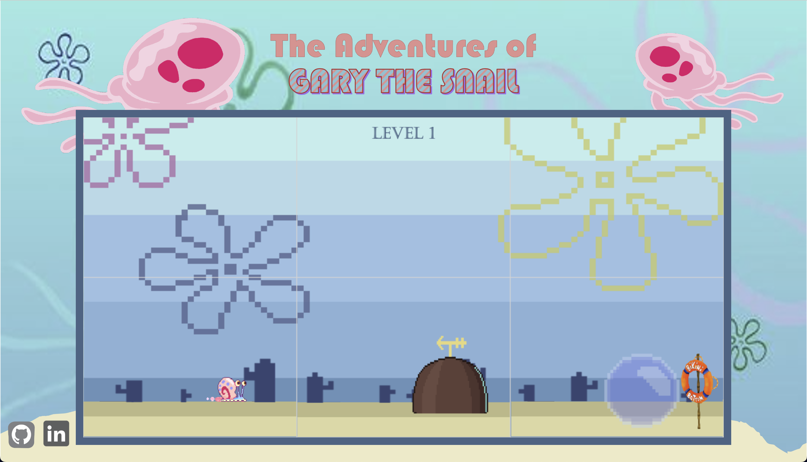
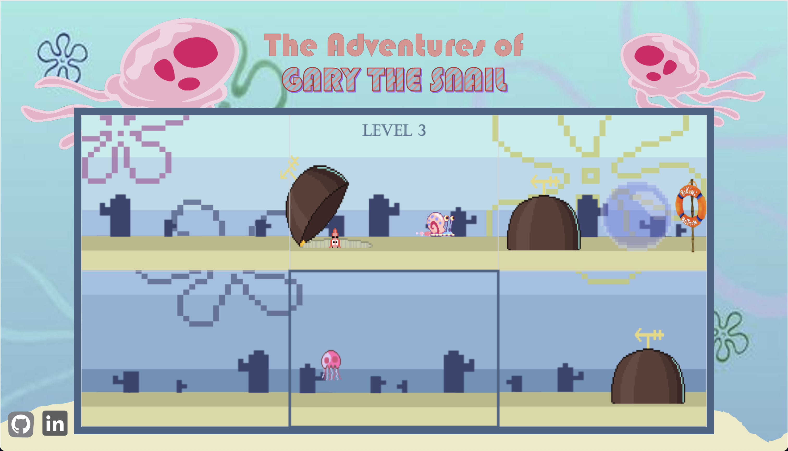
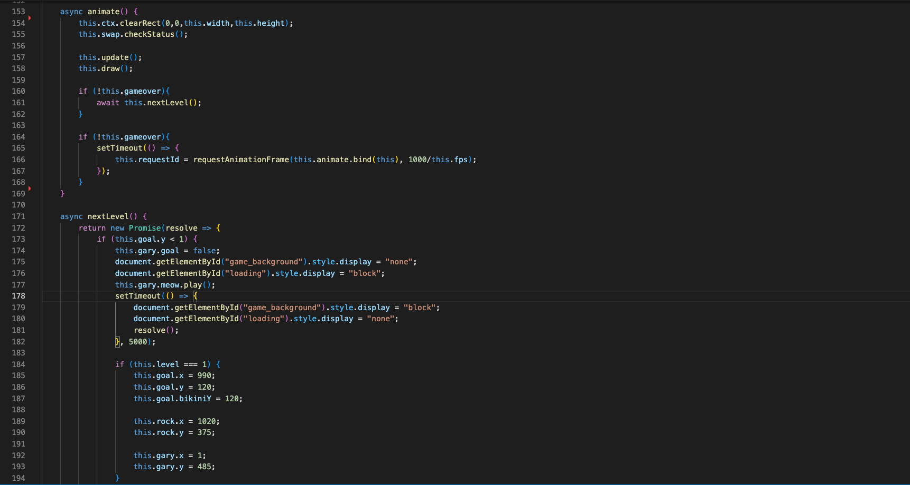
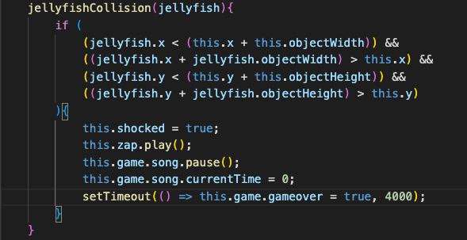
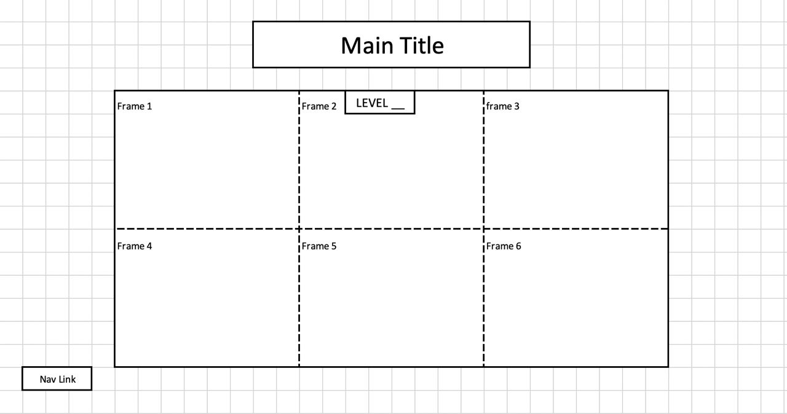

# <a href="https://chan-kevin.github.io/The-Adventures-of-Gary-the-Snail/">The Adventures of Gary the Snail</a>
## **For better experience, highly suggest sound on**

# **Background:**

The Adventures of Gary the Snail is a 2D interactive puzzle game where Gary the snail is lost underwater. The main objective of the game is to help Gary get to home to Spongebob in Bikini Bottom. 

There are 6 frames in a 2x3 formation in every scene which can be moved around to help Gary get from the starting frame to the frame where the bubble is at. Each bubble leads to the next scene/level. Gary moves in one fixed direction until he hits an obstacle, where he will either lose a life (jellyfish) or start moving in the opposite direction (rock).

The game intends to introduce functionalities slowly to allow users to get the hang of it. There will be approximately 3-5 levels in this game.

 

# **Functionalities:**

In The Adventures of Gary the Snail, user will be able to:
1. Swap the position of two frames by clicking consecutively on both frames.
2. Obstacles that cause the character to lose their lives will result in game over.
3. Upon touching bubble, Gary floats away in it and next level starts
4. Upon reaching Spongebob's house (pineapple) in final level, ending screen will appear and victory
5. A rule page will also be provided to the users

 

 

> ### It will shows a bold border after the player selects a frame. It will also show which frame player is hoving on.

 

# **Feature Implementation** #

 

> ### While going into next level, the above code using async to make sure Gary won't starting moving while player is in the loading page.

 

 

> ### Collision detection for jellyfish and gary. While the collision happens, the jellyfish will start another animation and plays the sound. And also setting game to gameover, using setTimeout to make sure the animation is done.

 

# **Wireframe:**

> - Nav links include links to this project's Github repo and my LinkedIn

## **Instruction and Explanation will be the follow:** 
### Help Gary get back home! Swap the position of frames by clicking consecutively on two frames, while making use of, or avoiding some obstacles: 
> - Rock: Changes the direction that Gary is moving in.
> - Jellyfish: Zaps Gary (Game Over) 

 

# **Technologies, Libraries, APIs**

This project will be implemented with the following technologies:
- The Canvas API to render the game board
- Collisions Detection
